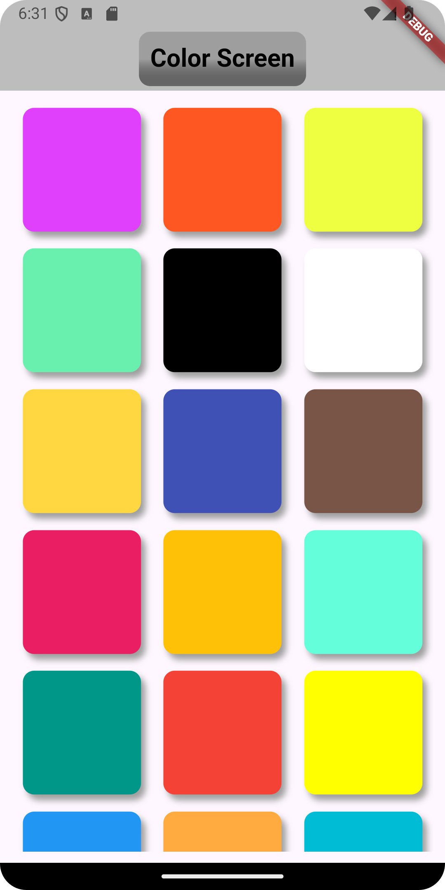
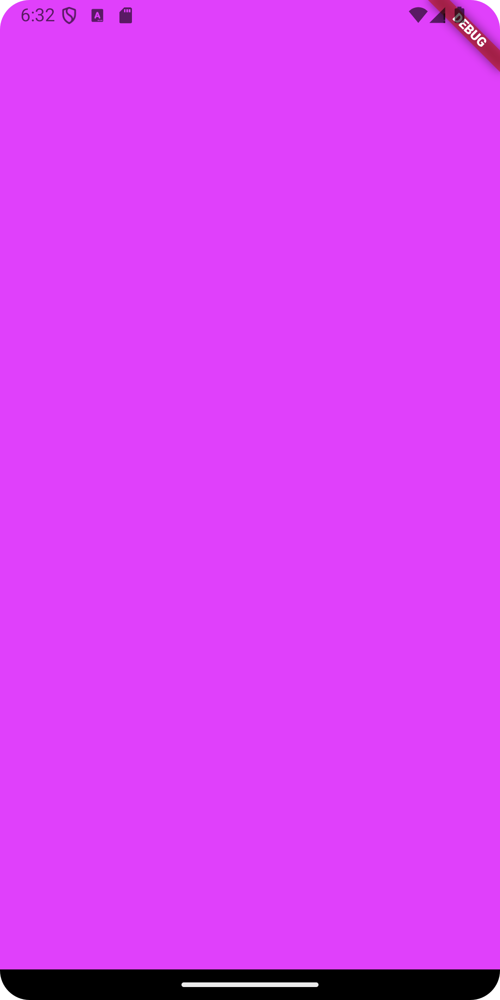
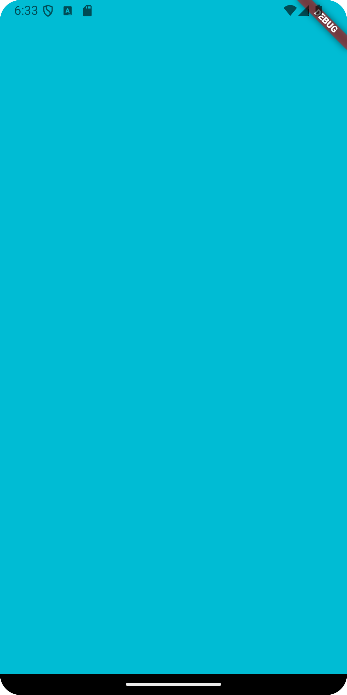
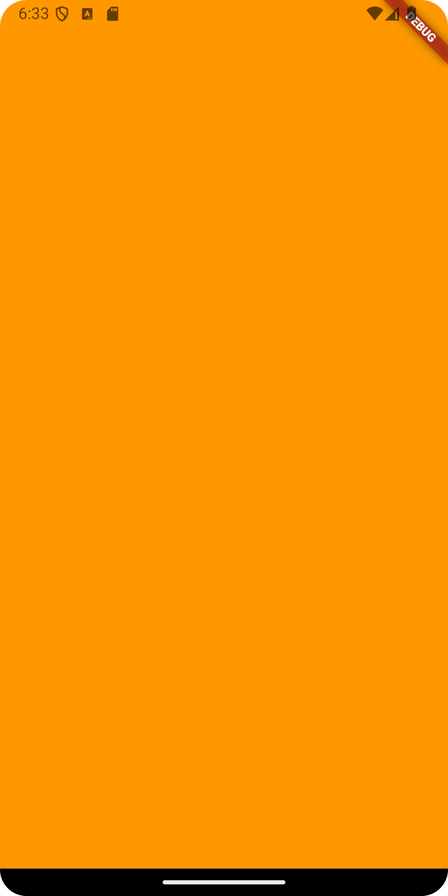

# Navigateur de Palette de Couleurs

**Navigateur de Palette de Couleurs** est une application mobile Flutter qui propose une grille d'options de couleurs pour les utilisateurs. Chaque couleur de la grille peut être sélectionnée pour afficher un écran plein de cette couleur. L'application est conçue avec simplicité et élégance, offrant un excellent outil pour expérimenter différentes couleurs et leurs effets visuels.

## Fonctionnalités

- **Grille de Couleurs** : Affichage d'une grille contenant diverses couleurs.
- **Navigation par Couleur** : Sélectionnez n'importe quelle couleur dans la grille pour afficher un écran plein de cette couleur.
- **Interface Lisse** : L'application offre des animations fluides et un design épuré, garantissant une expérience utilisateur sans faille.

## Installation

Pour exécuter cette application localement, suivez ces étapes :

1. **Cloner le dépôt** :
   ```bash
   git clone https://github.com/OussamaTouijer/Navigateur-de-Palette-de-Couleurs.git
   ```

2. **Accédez au répertoire du projet** :
   ```bash
   cd navigateur-de-palette-de-couleurs
   ```

3. **Installer les dépendances** :
   ```bash
   flutter pub get
   ```

4. **Exécuter l'application** :
   ```bash
   flutter run
   ```

## Utilisation

- Lors du lancement de l'application, vous verrez une grille de couleurs.
- Appuyez sur une couleur pour naviguer vers un affichage plein écran de cette couleur.
- Utilisez le bouton retour pour revenir à la grille et explorer d'autres couleurs.

## Captures d'écran

### Écran d'Accueil


### Écran de Couleur


<div style="display: flex;">

 
 
 
</div>
## Contribution

Les contributions sont les bienvenues ! Si vous avez des suggestions d'améliorations ou si vous trouvez des bugs, veuillez ouvrir une issue ou soumettre une pull request.

## Licence

Ce projet est sous licence MIT. Consultez le fichier LICENSE pour plus de détails.

## Contact

Pour toute question, veuillez contacter [oussama5touijer@gmail.com](mailto:oussama5touijer@gmail.com).
